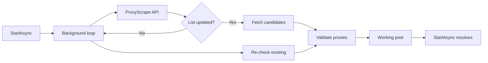

# InfiniteProxy

[](https://github.com/your-username/InfiniteProxy/actions/workflows/ci.yml)
[](https://www.nuget.org/packages/InfiniteProxy)
[](LICENSE)

**InfiniteProxy** is a .NET library that continuously discovers, validates, and maintains a live pool of free proxies in the background — 24/7.

It polls sources like [ProxyScrape](https://proxyscrape.com/) for updated lists, checks each proxy with real connection tests, and keeps only working endpoints. Call `StartAsync()` and it resolves as soon as at least one validated proxy is ready.

## Features

- **Background scanning** — runs continuously after `StartAsync()`, fetching new lists on a schedule
- **Update detection** — uses ProxyScrape metadata to re-fetch only when lists change
- **Real validation** — HTTP via `HttpClient`, SOCKS4/SOCKS5 via handshake + CONNECT
- **Multiple proxy types** — HTTP, SOCKS4, SOCKS5 (pick which ones you want)
- **Live pool API** — get all, random, or fastest working proxies at any time
- **Events** — subscribe to `ProxyAdded` / `ProxyRemoved` for reactive use
- **Extensible sources** — implement `IProxySource` to add more providers

## Installation

```bash
dotnet add package InfiniteProxy
```

Or reference the project directly:

```bash
git clone https://github.com/your-username/InfiniteProxy.git
dotnet add YourApp reference path/to/InfiniteProxy/src/InfiniteProxy/InfiniteProxy.csproj
```

## Quick start

```csharp
using InfiniteProxy;

var client = new InfiniteProxyClient(new InfiniteProxyOptions
{
    ProxyTypes = [ProxyType.Http, ProxyType.Socks5],
    FetchInterval = TimeSpan.FromMinutes(5),
    CheckTimeout = TimeSpan.FromSeconds(8)
});

// Starts background scanning; completes when the first working proxy is found
ProxyEndpoint first = await client.StartAsync();
Console.WriteLine($"Ready: {first}");

// Use the live pool anytime
ProxyEndpoint? random = client.GetRandom(ProxyType.Http);
ProxyEndpoint? fastest = client.GetFastest();
IReadOnlyList<ProxyEndpoint> all = client.GetProxies();

// React to new proxies
client.ProxyAdded += (_, e) => Console.WriteLine($"New proxy: {e.Proxy}");

// Stop when done
await client.StopAsync();
await client.DisposeAsync();
```

## Using proxies with HttpClient

```csharp
var proxy = client.GetRandom(ProxyType.Http)!;

var handler = new HttpClientHandler
{
    Proxy = new WebProxy(proxy.Host, proxy.Port),
    UseProxy = true
};

using var http = new HttpClient(handler);
var html = await http.GetStringAsync("https://example.com");
```

## Configuration

| Option | Default | Description |
|--------|---------|-------------|
| `ProxyTypes` | HTTP, SOCKS4, SOCKS5 | Which protocols to fetch and validate |
| `FetchInterval` | 5 minutes | How often to poll sources for updates |
| `RecheckInterval` | 15 minutes | How often to re-validate pooled proxies |
| `MaxConcurrentChecks` | 50 | Parallel validation limit |
| `CheckTimeout` | 10 seconds | Per-proxy validation timeout |
| `HttpValidationUrl` | `http://httpbin.org/ip` | URL for HTTP proxy checks |
| `SocksValidationHost` | `httpbin.org` | Host for SOCKS CONNECT checks |
| `Country` | `null` (all) | ISO country filter for ProxyScrape |
| `SourceLimit` | 2000 | Max proxies per fetch (ProxyScrape max) |

## How it works



1. **Fetch** — polls ProxyScrape (`/v4/free-proxy-list/get`) per enabled protocol
2. **Detect updates** — compares `proxyinfo` fingerprints to avoid redundant downloads
3. **Validate** — runs concurrent real connection checks with configurable timeout
4. **Pool** — stores working proxies; removes dead ones on re-check
5. **Ready** — `StartAsync()` completes when the first proxy passes validation

## Custom sources

Implement `IProxySource` to plug in additional providers:

```csharp
public sealed class MyProxySource : IProxySource
{
    public string Name => "MySource";

    public Task<IReadOnlyList<ProxyCandidate>> FetchAsync(ProxyType type, CancellationToken ct = default)
    {
        // Return ip:port candidates
    }

    public Task<ProxySourceInfo?> GetInfoAsync(ProxyType type, CancellationToken ct = default)
    {
        // Return fingerprint/count/last-updated for change detection
    }
}

var client = new InfiniteProxyClient(options, [new ProxyScrapeSource(options), new MyProxySource()]);
```

## Requirements

- .NET 8.0+
- Network access to ProxyScrape and validation endpoints

## Disclaimer

Free public proxies are unreliable by nature. InfiniteProxy validates connectivity but does not guarantee anonymity, speed, or uptime. Use responsibly and comply with applicable laws and terms of service.

## License

MIT — see [LICENSE](LICENSE).
